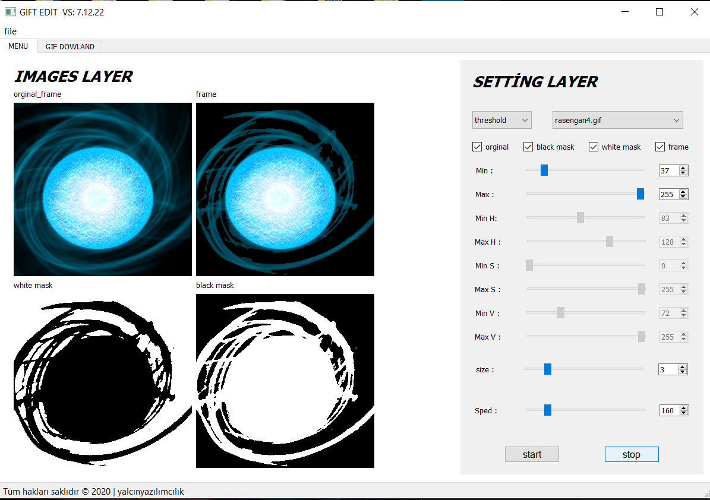
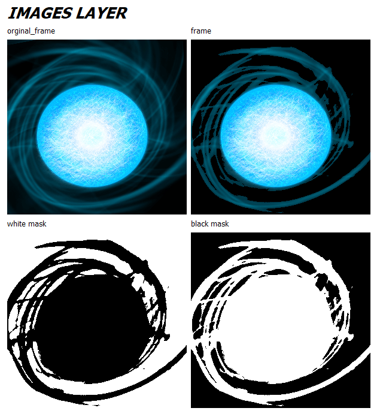
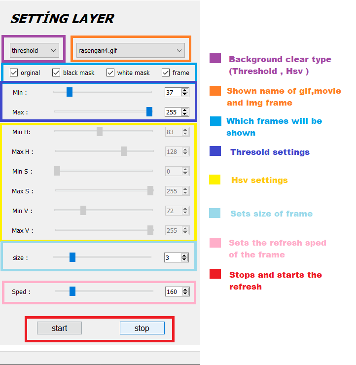
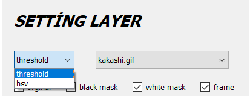
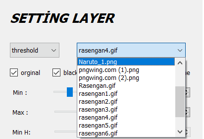
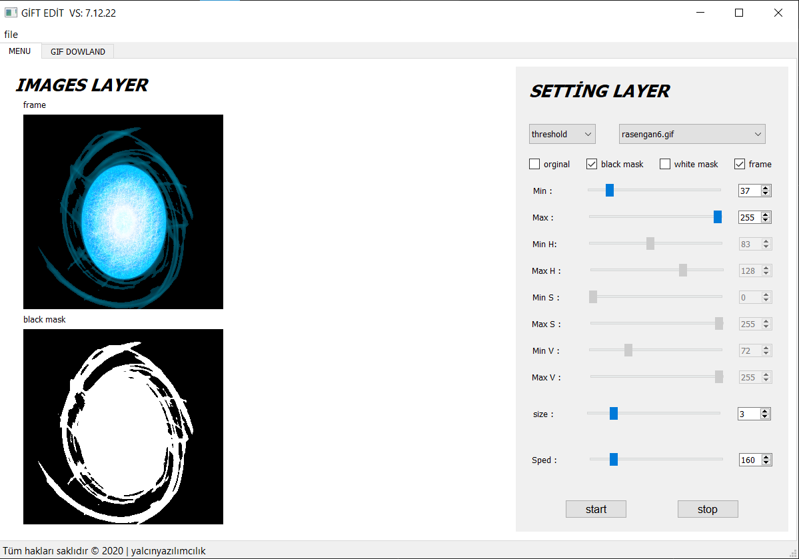
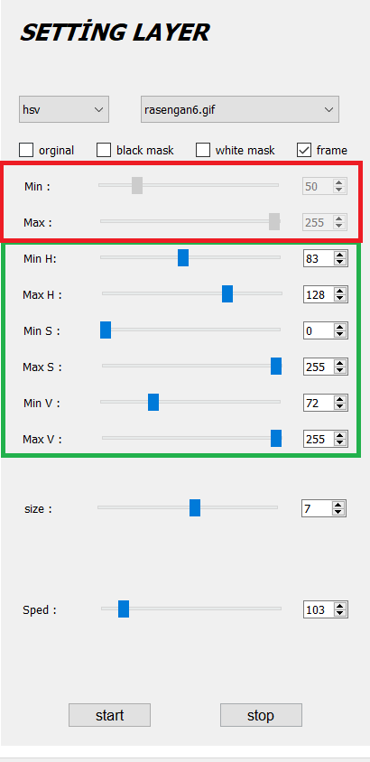
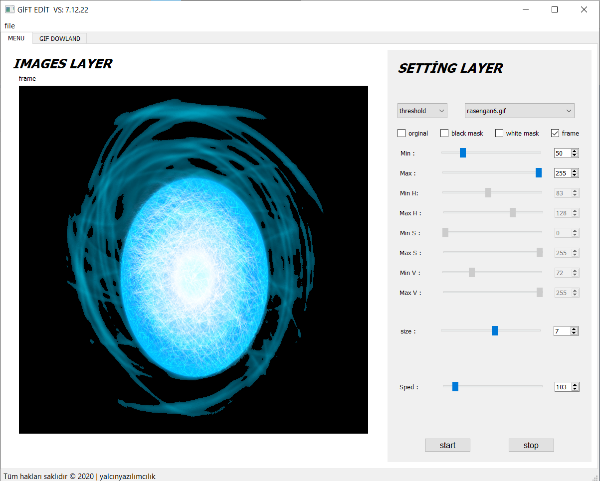
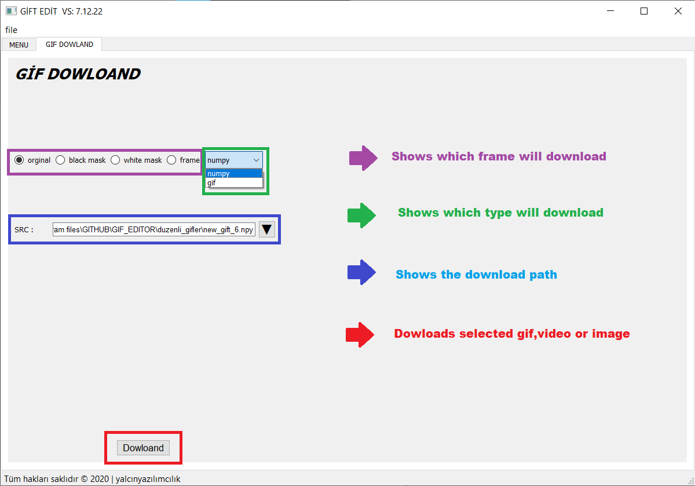

# **PROJE ADI : GİF EDİT**

 </img>

 

###  Python kullanarak oluşturmuş olduğum buuygulama sayesinde gif , kısa videolar ve resimlerinizi görüntü işleme tekniklerinden olan threshold ve hsv  tekniklerini kullanarak bu tip teki dosyalarınızın arkaplanlarını silmenize olanak tanır.

 

###  Projeyi biraz daha detaylı anlatırsak eyer proje içiresinde genel olarak gif ve resimler üzerine geliştirilmiş bir yazılımdır. Bu görevi yaparken olabildiğince kompleks hale gerilmeye çalışılmıştır. Bu görevleri yaparkende kulanıcıya olabildiğince basit bir şekilde yardım etmeye odaklanılmıştır.

 
 

# **PROJENİN TANITIMI**

 

### **SOL BÖLÜM**

 

 </img>

 Bu bölümde gif veya resim cerçevelerimiz bulunmakta ve sürekli yenilenerek  üzerinde yaptığımız işlemleri görmemize olanak tanır bu sayede  işlemleri yaparken dosyalarımızın değişmesini görebiliriz.

             

### **SAĞ BÖLÜM**

  

 </img>
 </img>
 </img>

            
    

 Bu bölümde gif veya resim cerçevelerimiz ile ilgii yapabileceğiniz işlemler bulunmaktadır. Yukarda da  görebileceğiniz gibi  dosyalarınıza bu işlemleri uygulayarak istediğiniz renk aralığındaki görüntüleri diyer katmanlardan ayırabilirsiniz .

 GUI de görüneceği gibi sağ taraf resimler üzerindeki işlemler için ayrılmıştır burda hangi ayarlar var. sağ üste görülen iki kutudan soldaki işlem türünü belirtiyor sağdaki ise işlemin hangi dosyaya yapılacağını belirer .

 </img>
                    

Bunların altında bulunan Checkbox lar da ise bu görüntünün hangi işlemlerden geçtiğini GUI üzerinden kulanıcıya gösteren kısımdır burda istediğiniz işlemleri GUI yardımı ile görebilirsiniz  

 </img>

 

Bunların altında bulunan Checkbox lar da ise bu görüntünün hangi işlemlerden geçtiğini GUI üzerinden kulanıcıya gösteren kısımdır burda istediğiniz işlemleri GUI yardımı ile görebilirsiniz.

 Örneğin solda göründüğü gibi hsv ayarı seçildiğinde threshold ayarlarının kapalı hsv ayarlarının açık olduğu gözükmekte  

 </img>

                              
    

Bunların altında ise bulunan  size değerinide değiştirerek çerçevelerinizin boyunu ayarlayabilirsiniz  

 Sonraki ayarda ise çerçevelerinizin GUI üzerinden yenilenme hızlarını yansıtmaktadır.  

### En sondaki tuşlar ise çerçevelerinizin yenilenmelerini durdurmaktadır.

     

### **DOWLOAD SEKMESİ**

 

 </img>

### Download sekmesinde ise dosyalarımızın tipine ve istediğimiz maskeleme şeklini seçerek belirtiğiniz yola indirmenizi sağlamaktadır ,

